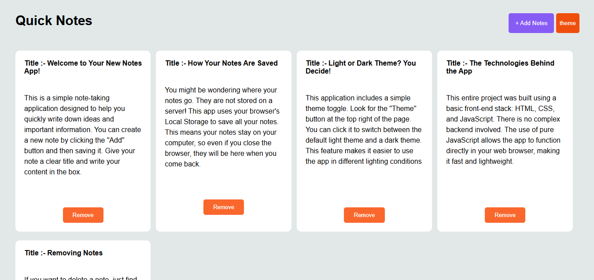

                                                                Notes App 📝

A simple and intuitive notes application built with pure HTML, CSS, and JavaScript. This project allows users to create, save, and manage their notes effortlessly right in their browser.

✨ Key Features
Create & Save Notes: Quickly add new notes with a title and content.

Persistent Storage: All your notes are automatically saved using the browser's Local Storage, so they'll be there even after you close the tab.

Dynamic UI: Notes are dynamically added to the page without a full refresh.

Theme Toggle: Switch between a modern light and a sleek dark theme with a single click.

💻 How to Use
Clone the repository:

Bash

git clone https://github.com/sohananuragi/your-repo-name.git
Open the file:
Simply open the index.html file in your preferred web browser. No server or additional setup is required!

🛠️ Technologies Used
HTML5: For the structure of the application.

CSS3: For all styling and theme management.

JavaScript: For all interactive functionality, including DOM manipulation and Local Storage.

Author
Made with passion by Sohan Anuragi ❤️

